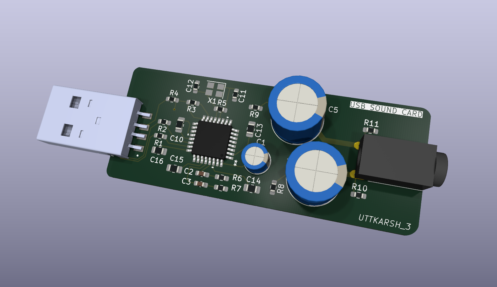
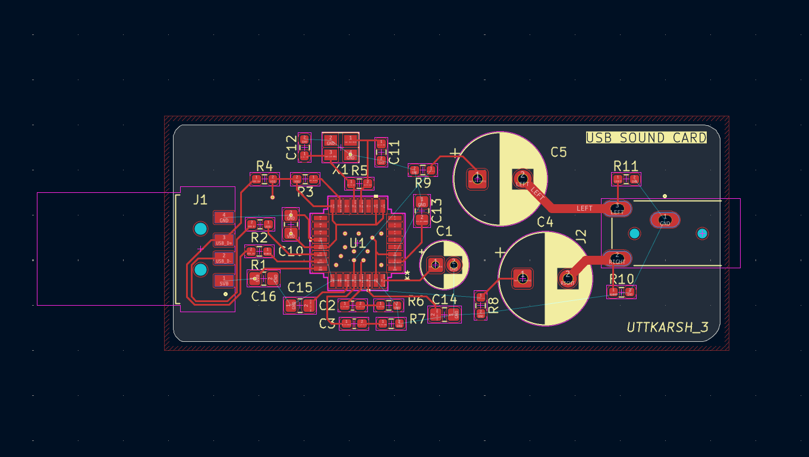
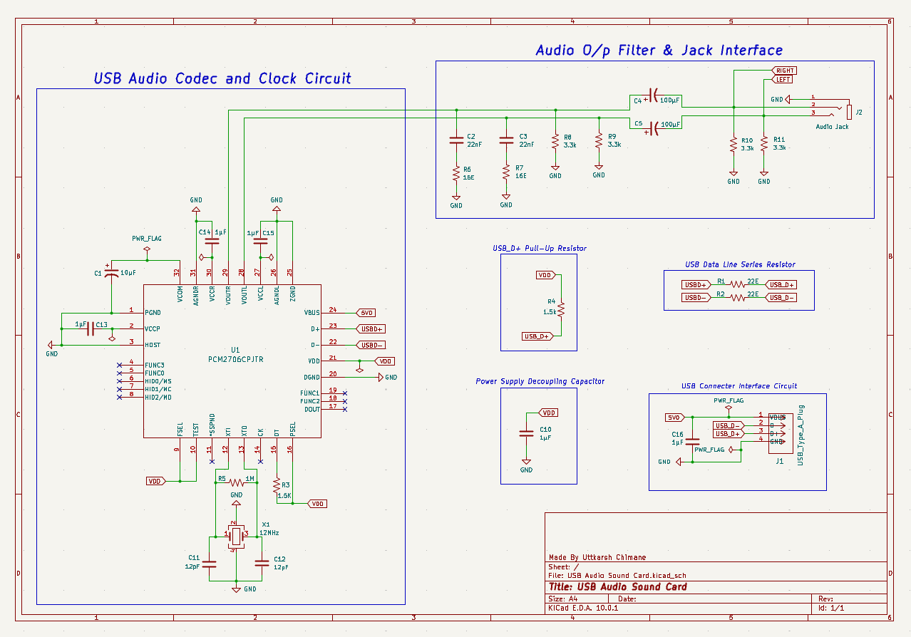

# ⚡ PCM2706 USB Audio Sound Card

---

## ⚙️ What I Built

A compact USB-powered stereo audio sound card designed around the Texas Instruments PCM2706C USB Audio Codec. The device converts USB digital audio streams into analog stereo output and provides a simple plug-and-play audio interface for computers supporting the USB Audio Class standard.

---

## 🚀 Overview

This project implements a USB audio playback device using the PCM2706C USB audio codec. The design integrates USB communication, clock generation, analog audio filtering, and stereo output circuitry on a compact PCB developed in KiCad.

The board is powered directly from the USB port and outputs analog audio through a 3.5 mm audio jack.

---

## 📷 Project Gallery

🧩 **3D PCB Render**

🔌 **PCB Layout**

⚙️ **Schematic**

---

## 📑 Component Reference Sheet

The complete component reference sheet is available here:

📄 [Reference.xlsx](docs/reference.xlsx)

The spreadsheet contains:
- Reference Designators
- Quantity
- Component Values
- Package Information
- Footprint Assignments
- Brief Component Descriptions

---

## ✨ Features

* USB Audio Class compliant architecture
* PCM2706C USB audio codec
* USB bus powered (5 V)
* Stereo analog audio output
* Integrated RC output filtering network
* 12 MHz crystal clock source
* Compact PCB footprint
* Designed using KiCad

---

## ⚒️ Hardware Architecture

USB Host
    │
    ▼
USB Connector
    │
    ▼
PCM2706C USB Audio Codec
    │
    ▼
RC Output Filter
    │
    ▼
3.5 mm Stereo Audio Jack

---

## 🧠 Schematic Highlights

**USB Interface**

* USB D+ and D− lines routed through 22 Ω series resistors.
* Pull-up resistor used for USB device detection.
* USB bus-powered operation.

**Clock Generation**

* 12 MHz crystal oscillator connected to the PCM2706C.
* Load capacitors selected according to crystal requirements.

**Audio Output Stage**

* Analog left and right channels filtered using RC networks.
* AC coupling capacitors remove DC offset before audio output.
* Stereo output available through a 3.5 mm audio jack.

**Power Integrity**

* Dedicated decoupling capacitors placed near codec supply pins.
* Separate analog and digital supply filtering considerations included.

---

## 🧩 PCB Design Insights

The PCB was designed as a compact single-board implementation with:

* Short USB signal paths
* Local decoupling near the codec IC
* Crystal placement close to oscillator pins
* Dedicated analog output filtering section
* 3D mechanical verification using external component models

---

## 🧪 Applications

* USB-to-analog audio conversion
* External USB sound card prototyping
* Educational projects involving USB Audio Class devices
* Audio codec evaluation and experimentation
* Mixed-signal PCB design learning
* Embedded audio hardware development

---

## ⚠️ Limitations

This project is intended for educational and design demonstration purposes.

* No integrated headphone amplifier stage
* Design has not been physically fabricated or tested
* Intended primarily for line-level audio output

---

## 🚀 Future Improvements

* USB-C connector variant
* Headphone amplifier stage
* ESD protection circuitry
* Improved analog output filtering
* Revision B PCB optimization

---

## 🛠️ Design Software

* KiCad 10
* Custom and vendor-provided symbol libraries
* Vendor STEP/IGES mechanical models
